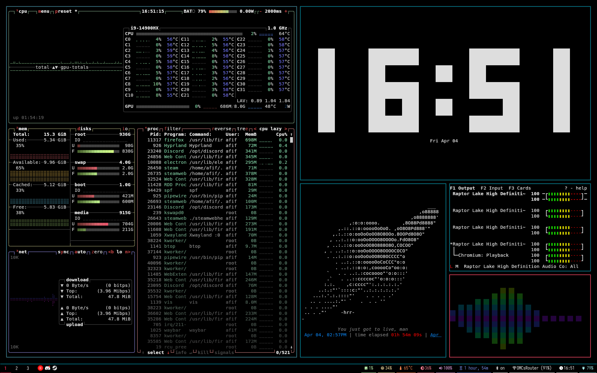

# Wammo's adhd DotFiles



First attempt at ricing.

The blue color is the same as the default lighting on an Acer PHN16-72

## REQUIREMENTS:

+ hyprpaper
+ waybar
+ hypridle
+ swaync
+ poweralertd
+ btop
+ pulsemixer
+ vis
+ peaclock
+ arttime
+ superfile
+ mpv

**AIO command for Arch Linux**

```bash
sudo pacman -S hyprpaper & waybar & hypridle & swaync & poweralertd & btop & pulsemixer & vis & peaclock & arttime & superfile & mpv
```
